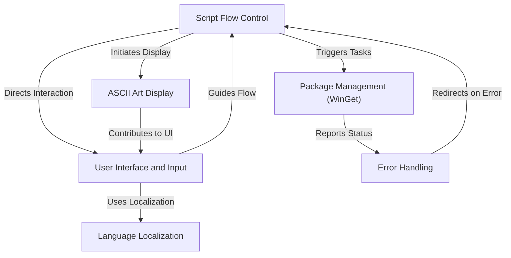

# Tutorial: win-get_install_script

This script is designed to **automate the installation and updating of software** on Windows using the WinGet package manager.
It features a **multilingual interactive menu** for users to choose tasks like installing VS Code or updating all apps.
The script also includes basic **error handling** and a decorative **ASCII art welcome** message.

## Visual Overview

## Chapters

1. [Package Management (WinGet)
](01_package_management__winget__.md)
2. [User Interface and Input
](02_user_interface_and_input_.md)
3. [Language Localization
](03_language_localization_.md)
4. [ASCII Art Display
](04_ascii_art_display_.md)
5. [Script Flow Control
](05_script_flow_control_.md)
6. [Error Handling
](06_error_handling_.md)

---
